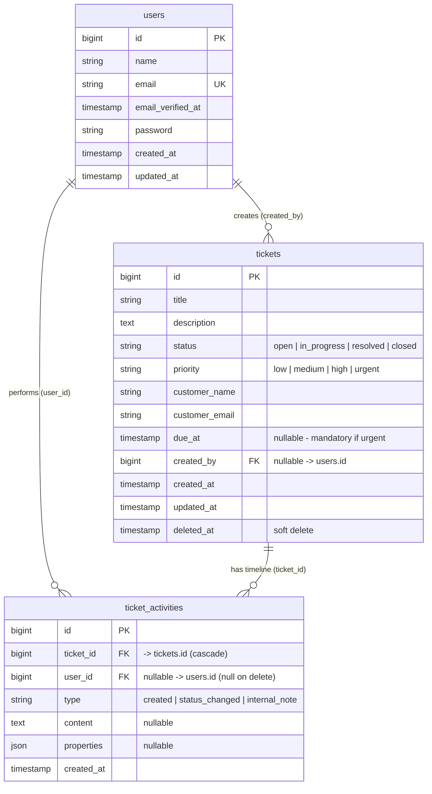

# Support Ticket Management — Database Architecture & Data Dictionary

This document details the database schema, table relationships, indexing strategy, and state transition logic for the Support Ticket Management System.

---

## 1. Database Connection

| Connection Name | Physical Database | Driver | Description |
|---|---|---|---|
| `mysql` (default) | `helpdesk` | MySQL 8.x / MariaDB | Stores user credentials, support tickets, audit activity logs, and system sessions. |

---

## 2. Technical Entity Relationship Diagram (ERD)



---

## 3. Table Dictionary

### 3.1 `tickets` Table

Represents customer support tickets tracked through their operational lifecycle.

| Column | Type | Nullable | Default | Description |
|---|---|---|---|---|
| `id` | `BIGINT UNSIGNED` | No | Auto Increment | Primary key. |
| `title` | `VARCHAR(255)` | No | — | Summary of customer issue. |
| `description` | `TEXT` | No | — | Detailed problem description. |
| `status` | `VARCHAR(50)` | No | `'open'` | Current status (`open`, `in_progress`, `resolved`, `closed`). |
| `priority` | `VARCHAR(50)` | No | `'medium'` | Urgency level (`low`, `medium`, `high`, `urgent`). |
| `customer_name` | `VARCHAR(255)` | No | — | Full name of the customer. |
| `customer_email` | `VARCHAR(255)` | No | — | Valid contact email. |
| `due_at` | `TIMESTAMP` | Yes | `NULL` | SLA deadline. Mandatory when `priority = 'urgent'`. |
| `created_by` | `BIGINT UNSIGNED` | Yes | `NULL` | Foreign key referencing `users.id`. Null on user deletion. |
| `created_at` | `TIMESTAMP` | Yes | `NULL` | Record creation timestamp. |
| `updated_at` | `TIMESTAMP` | Yes | `NULL` | Last record update timestamp. |
| `deleted_at` | `TIMESTAMP` | Yes | `NULL` | Soft delete timestamp. |

#### Database Indexes on `tickets`

| Index Name | Type | Columns | Rationale |
|---|---|---|---|
| `PRIMARY` | Primary Key | `id` | Unique row identification. |
| `tickets_status_index` | Index | `status` | High-frequency single-field status filtering. |
| `tickets_priority_index` | Index | `priority` | High-frequency priority filtering. |
| `tickets_due_at_index` | Index | `due_at` | Rapid SLA breach detection (`due_at < NOW()`). |
| `tickets_created_by_index` | Index | `created_by` | Foreign key lookups and creator filtering. |
| `tickets_status_priority_created_at_index` | Composite | `status, priority, created_at` | Optimizes filtered, sorted pagination in `TicketController@index`. |

---

### 3.2 `ticket_activities` Table

Immutable audit trail logging every lifecycle event, status transition, and internal staff discussion note.

| Column | Type | Nullable | Default | Description |
|---|---|---|---|---|
| `id` | `BIGINT UNSIGNED` | No | Auto Increment | Primary key. |
| `ticket_id` | `BIGINT UNSIGNED` | No | — | Foreign key referencing `tickets.id` (`ON DELETE CASCADE`). |
| `user_id` | `BIGINT UNSIGNED` | Yes | `NULL` | Foreign key referencing `users.id` (`ON DELETE SET NULL`). |
| `type` | `VARCHAR(50)` | No | — | Event type: `created`, `status_changed`, `internal_note`. |
| `content` | `TEXT` | Yes | `NULL` | Staff comment or event narrative. |
| `properties` | `JSON` | Yes | `NULL` | Structured metadata (e.g. `{"from": "open", "to": "in_progress"}`). |
| `created_at` | `TIMESTAMP` | No | `CURRENT_TIMESTAMP` | Event timestamp. |

#### Database Indexes on `ticket_activities`

| Index Name | Type | Columns | Rationale |
|---|---|---|---|
| `PRIMARY` | Primary Key | `id` | Unique row identification. |
| `ticket_activities_ticket_id_foreign` | Foreign Key | `ticket_id` | Enforces referential integrity with cascade delete. |
| `ticket_activities_user_id_foreign` | Foreign Key | `user_id` | Enforces referential integrity with user records. |
| `ticket_activities_type_index` | Index | `type` | Fast filtering of activity types (e.g., notes vs transitions). |
| `ticket_activities_created_at_index` | Index | `created_at` | Chronological sorting on Ticket Detail timeline. |

---

## 4. Status State Machine Transition Matrix

The table enforces business transition rules programmatically in the domain layer (`TicketStatus` enum & `TicketService`):

| Current Status | Target: `open` | Target: `in_progress` | Target: `resolved` | Target: `closed` | Notes |
|---|:---:|:---:|:---:|:---:|---|
| **`open`** | — | **ALLOWED** | **ALLOWED** | FORBIDDEN | Cannot bypass work directly to closed. |
| **`in_progress`** | **ALLOWED** | — | **ALLOWED** | FORBIDDEN | Must be resolved before closure. |
| **`resolved`** | FORBIDDEN | **ALLOWED** | — | **ALLOWED** | Can be reopened to in_progress or confirmed closed. |
| **`closed`** | FORBIDDEN | FORBIDDEN | FORBIDDEN | — | **Terminal state**: Closed tickets are immutable. |

---

## 5. SLA Health Computation

Real-time SLA status is dynamically calculated via Eloquent accessors and query scopes:

```text
               ┌─────────────────────────┐
               │ due_at is NULL or       │
               │ status IN (resolved,    │ ───► SLA Status = "none"
               │            closed)      │
               └─────────────────────────┘
                            │
               ┌────────────▼────────────┐
               │   Is due_at < NOW()?    │ ───► SLA Status = "breached" (Danger)
               └────────────┬────────────┘
                            │ No
               ┌────────────▼────────────┐
               │ due_at <= NOW() + 4 hrs │ ───► SLA Status = "due_soon" (Warning)
               └────────────┬────────────┘
                            │ No
               ┌────────────▼────────────┐
               │  due_at > NOW() + 4 hrs │ ───► SLA Status = "on_track" (Healthy)
               └─────────────────────────┘
```
